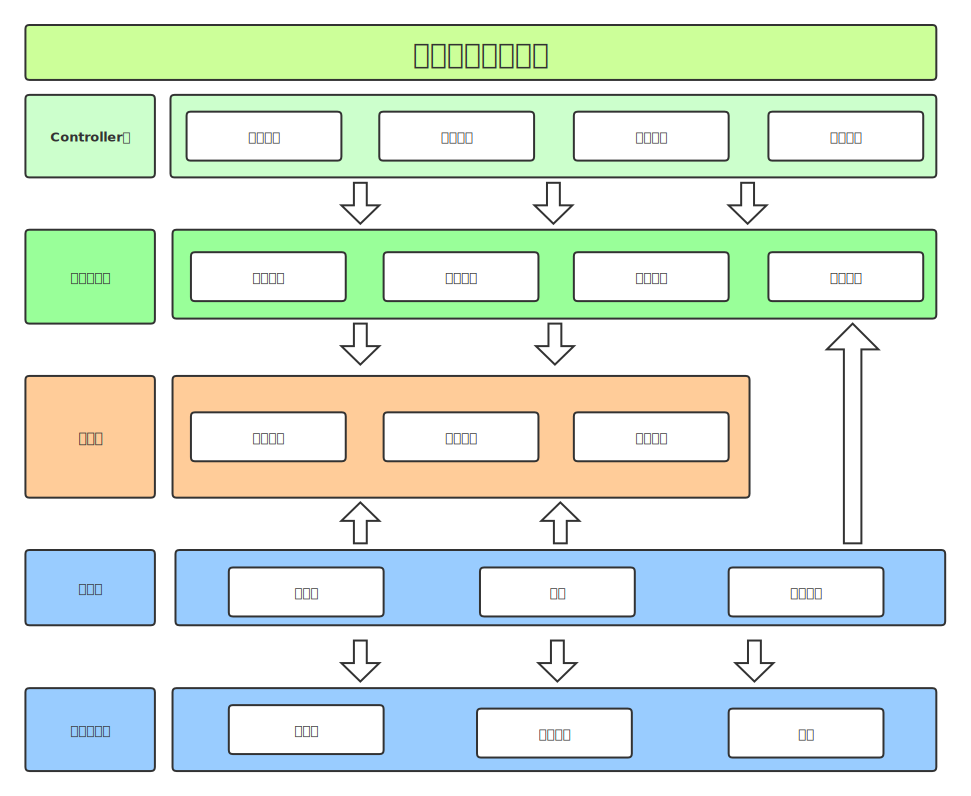

# UserService

支持全球80亿人口的可演进的用户中心架构

# 逻辑架构

## 用例模型

## 用例描述

### 用户注册

<table> 
  <tr>
     <td colspan="2">用例标识</td>
     <td>USER_000001</td>
     <td>用例名称</td>
     <td>用户注册</td>
     <td>用例类型</td>
     <td>业务功能</td>
  </tr>
  <tr>
    <td colspan="2" >用例描述</td>
    <td colspan="10"> 用户录入基本信息、登录密码, 校验通过后, 注册成功</td>
  </tr>
  <tr>
    <td colspan="2"> 角色 </td>
    <td colspan="10"> 用户 </td>
  </tr>
  <tr>
    <td colspan="2" >前触发事件</td>
    <td colspan="10" >      
    </td>

</tr>

<tr>
   <td rowspan="3">事件流</td>
   <td>
      基流
   </td>
   <td colspan="10" > 
    1、用户录入基本信息、输入密码，提交注册  
    2、校验用户信息通过  
    3、用户注册成功
   </td>
  </tr>
  <tr>  
   <td>
      分支流
   </td>
   <td colspan="10"></td>
  </tr>
  <tr>  
   <td>
      替代流
   </td>
   <td colspan="10">
      2.1  校验用户信息不通过, 用户注册失败
   </td>
  </tr>

<tr>
    <td colspan="2"> 后触发事件 </td>
    <td colspan="10">
       <table>
         <thead>
            <th>事件编号</th>
            <th>事件名称</th>
         </thead>
         <tbody>
            <td>E_USER_000001</td>
            <td>用户注册成功</td>
         </tbody>
      </table>
    </td>
  </tr>
  <tr>
    <td colspan="2">非功能性需求</td>
    <td colspan="10"> 
      支持全球80亿用户注册
    </td>
  </tr>
</table>

### 用户登录

<table> 
  <tr>
     <td colspan="2">用例标识</td>
     <td>USER_000002</td>
     <td>用例名称</td>
     <td>用户登录</td>
     <td>用例类型</td>
     <td>业务功能</td>
  </tr>
  <tr>
    <td colspan="2" >用例描述</td>
    <td colspan="10"> 用户录入登录信息, 校验通过后, 登录成功</td>
  </tr>
  <tr>
    <td colspan="2"> 角色 </td>
    <td colspan="10"> 用户 </td>
  </tr>
  <tr>
    <td colspan="2" >前触发事件</td>
    <td colspan="10">
      <table>
         <thead>
            <th>事件编号</th>
            <th>事件名称</th>
         </thead>
         <tbody>
            <td>E_USER_000001</td>
            <td>用户注册成功</td>
         </tbody>
      </table>
    </td>
  </tr>
  <tr>
   <td rowspan="3">事件流</td>
   <td>
      基流
   </td>
   <td colspan="10" > 
    1、用户录入用户号、输入密码，提交登录  
    2、校验用户信息通过  
    3、用户登录成功
   </td>
  </tr>
  <tr>  
   <td>
      分支流
   </td>
   <td colspan="10">      
      1.1  用户录入手机号，输入密码，提交登录
      1.2  用户录入手机号，输入验证码，提交登录
   </td>
  </tr>
  <tr>  
   <td>
      替代流
   </td>
   <td colspan="10">
      2.1  校验用户信息不通过, 用户登录失败
   </td>
  </tr>

<tr>
    <td colspan="2"> 后触发事件 </td>
    <td colspan="10">
      <table>
         <thead>
            <th>事件编号</th>
            <th>事件名称</th>
         </thead>
         <tbody>
            <td>E_USER_000002</td>
            <td>用户登录成功</td>
         </tbody>
      </table>
    </td>
  </tr>
  <tr>
    <td colspan="2">非功能性需求</td>
    <td colspan="10"> 
      支持全球80亿用户登录
    </td>
  </tr>
</table>

### 修改密码

<table> 
  <tr>
     <td colspan="2">用例标识</td>
     <td>USER_000003</td>
     <td>用例名称</td>
     <td>修改密码</td>
     <td>用例类型</td>
     <td>业务功能</td>
  </tr>
  <tr>
    <td colspan="2" >用例描述</td>
    <td colspan="10"> 用户输入新密码, 校验通过后, 修改成功</td>
  </tr>
  <tr>
    <td colspan="2"> 角色 </td>
    <td colspan="10"> 用户 </td>
  </tr>
  <tr>
    <td colspan="2" >前触发事件</td>
    <td colspan="10">
      <table>
         <thead>
            <th>事件编号</th>
            <th>事件名称</th>
         </thead>
         <tbody>
            <td>E_USER_000002</td>
            <td>用户登录成功</td>
         </tbody>
      </table>
    </td>
  </tr>
  <tr>
   <td rowspan="3">事件流</td>
   <td>
      基流
   </td>
   <td colspan="10" > 
    1、用户输入旧密码，新密码，提交修改  
    2、校验信息通过  
    3、修改密码成功
    4、用户退出登录态，跳转登录页
   </td>
  </tr>
  <tr>  
   <td>
      分支流
   </td>
   <td colspan="10">
   </td>
  </tr>
  <tr>  
   <td>
      替代流
   </td>
   <td colspan="10">
      2.1  校验不通过, 修改密码失败
   </td>
  </tr>

<tr>
    <td colspan="2"> 后触发事件 </td>
    <td colspan="10">
      <table>
         <thead>
            <th>事件编号</th>
            <th>事件名称</th>
         </thead>
         <tbody>
            <td>E_USER_000003</td>
            <td>修改密码成功</td>
         </tbody>
      </table>
    </td>
  </tr>
  <tr>
    <td colspan="2">非功能性需求</td>
    <td colspan="10"> 
      支持全球80亿用户
    </td>
  </tr>
</table>

### 修改个人信息

<table> 
  <tr>
     <td colspan="2">用例标识</td>
     <td>USER_000004</td>
     <td>用例名称</td>
     <td>修改个人信息</td>
     <td>用例类型</td>
     <td>业务功能</td>
  </tr>
  <tr>
    <td colspan="2" >用例描述</td>
    <td colspan="10"> 用户修改个人信息, 校验通过后, 修改成功</td>
  </tr>
  <tr>
    <td colspan="2"> 角色 </td>
    <td colspan="10"> 用户 </td>
  </tr>
  <tr>
    <td colspan="2" >前触发事件</td>
    <td colspan="10">
      <table>
         <thead>
            <th>事件编号</th>
            <th>事件名称</th>
         </thead>
         <tbody>
            <td>E_USER_000002</td>
            <td>用户登录成功</td>
         </tbody>
      </table>
    </td>
  </tr>
  <tr>
   <td rowspan="3">事件流</td>
   <td>
      基流
   </td>
   <td colspan="10" > 
    1、用户输入新的个人信息，提交修改  
    2、校验信息通过  
    3、修改个人信息成功
   </td>
  </tr>
  <tr>  
   <td>
      分支流
   </td>
   <td colspan="10">
   </td>
  </tr>
  <tr>  
   <td>
      替代流
   </td>
   <td colspan="10">
      2.1  校验不通过, 修改个人信息失败
   </td>
  </tr>

<tr>
    <td colspan="2"> 后触发事件 </td>
    <td colspan="10">
      <table>
         <thead>
            <th>事件编号</th>
            <th>事件名称</th>
         </thead>
         <tbody>
            <td>E_USER_000004</td>
            <td>修改个人信息成功</td>
         </tbody>
      </table>
    </td>
  </tr>
  <tr>
    <td colspan="2">非功能性需求</td>
    <td colspan="10"> 
      支持全球80亿用户
    </td>
  </tr>
</table>

### 修改手机号

<table> 
  <tr>
     <td colspan="2">用例标识</td>
     <td>USER_000005</td>
     <td>用例名称</td>
     <td>修改手机号</td>
     <td>用例类型</td>
     <td>业务功能</td>
  </tr>
  <tr>
    <td colspan="2" >用例描述</td>
    <td colspan="10"> 用户手机号, 校验通过后, 修改成功</td>
  </tr>
  <tr>
    <td colspan="2"> 角色 </td>
    <td colspan="10"> 用户 </td>
  </tr>
  <tr>
    <td colspan="2" >前触发事件</td>
    <td colspan="10">
      <table>
         <thead>
            <th>事件编号</th>
            <th>事件名称</th>
         </thead>
         <tbody>
            <td>E_USER_000002</td>
            <td>用户登录成功</td>
         </tbody>
      </table>
    </td>
  </tr>
  <tr>
   <td rowspan="3">事件流</td>
   <td>
      基流
   </td>
   <td colspan="10" > 
    1、用户输入新的手机号，手机验证码，提交修改  
    2、校验信息通过  
    3、修改手机号成功
   </td>
  </tr>
  <tr>  
   <td>
      分支流
   </td>
   <td colspan="10">
   </td>
  </tr>
  <tr>  
   <td>
      替代流
   </td>
   <td colspan="10">
      2.1  校验不通过, 修改手机号失败
   </td>
  </tr>

<tr>
    <td colspan="2"> 后触发事件 </td>
    <td colspan="10">
      <table>
         <thead>
            <th>事件编号</th>
            <th>事件名称</th>
         </thead>
         <tbody>
            <td>E_USER_000005</td>
            <td>修改手机号成功</td>
         </tbody>
      </table>
    </td>
  </tr>
  <tr>
    <td colspan="2">非功能性需求</td>
    <td colspan="10"> 
      支持全球80亿用户
    </td>
  </tr>
</table>

## 领域模型

# 数据架构

## 问题

1、80亿用户，无法用一个数据库存储，需要分库
2、需要有一个全局用户编号生成器，保证用户编号的唯一性
3、需要有一个数据路由服务，定位用户在哪个库
4、支持横向扩展，演进式按需扩容

## 解决方案

1、 假设每个库存放500万用户，80亿用户，需要 80亿/500万 = 1600 个分库
2、 使用Redis作为用户编号生成的数据库，前缀U,加10个数字，有序递增生成
3、 用户编号的10个数字 求 500万 的商, 商代表分库编号， 手机号 跟 用户编号的映射关系存放在Redis， Redis需要 (11字节+11字节) * 80亿 / 1 GB = 163.9 G
4、 用户编号有序递增，求 500万 的商, 商代表分库编号，一开始只需要一个分库，就能满足需求，后续用户将超过500万，新增一个分库横向扩展，随着用户不断增长，能够演进式按需扩容

## 数据模型

### 总体er图

### 用户基本信息user_base

### 用户事件user_event

### 手机号-用户编号-映射

key | value  
:- | :-
user_base.mobile | user_base.user_id

## 数据流

用户注册数据流图

手机号登录数据流图

用户编号登录数据流图

用户编号路由数据流图

# 开发架构

## 系统规划

## 系统分层

# 运行架构
针对非功能性需求，进一步的细化开发架构

## 用户读写服务架构

## 用户查询服务架构

